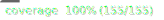

# Smelly Mars Rover Kata


[](https://sonarcloud.io/summary/new_code?id=MacMannes_smelly-mars-rover-kata)

## Description

...

## Unit tests

Run the unit test with this command:

```shell
pnpm run test
```

## Coverage of unit tests

You can check the code coverage and view the html results by running this
command:

```shell
pnpm run test:coverage && open coverage/index.html
```

### Setting up SonarCloud

This project assumes your SonarCloud organization name is the same as your
GitHub user name. If this is not the case, you can change the
`sonar.organization` property in the file `sonar-project.properties` to your
SonarCloud organization name.

In order to use SonarCloud, you need to create a new project in SonarCloud and
add a Secret named `SONAR_TOKEN` to this project. You can do that in the
settings of this project under \*Secrets and variables/Actions. You can also
follow [this link]
(https://github.com/MacMannes/smelly-mars-rover-kata/settings/secrets/actions/new)
to go directly to form in which you can enter the secret.

After you've created the secret, you can create a new project in SonarCloud by
visiting this URL: https://sonarcloud.io/projects/create
